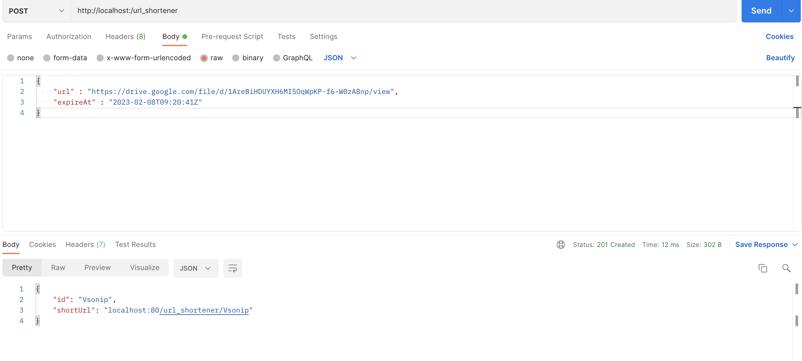
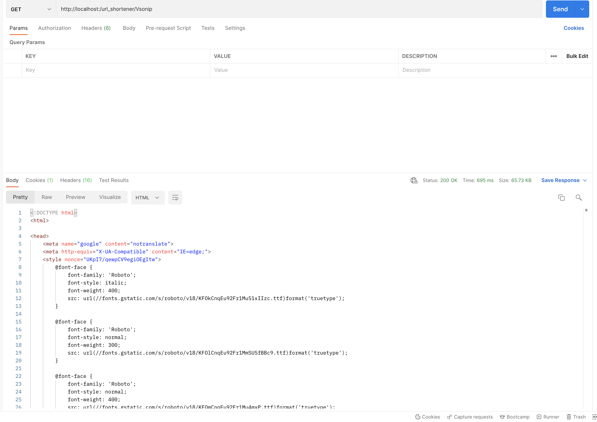
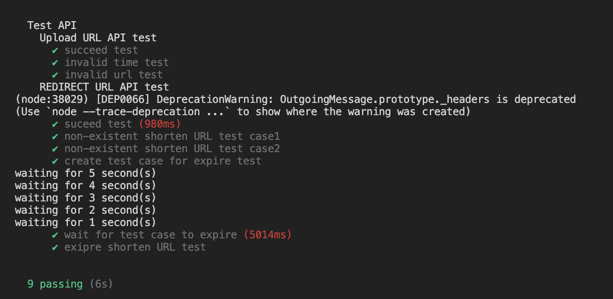

# url-shortener Restful API

## Description

服務使用 postgresql 作為 database， Redis 作為 cache storage，用作降低 DB 的讀取量，提高reponse速度， 並在cache中維護 “prefix” 來快速偵測 non-exisetent shorten URL

## DB schema
|Name  | Data type | Description |
|------|------|------|
|id(PK)| text| short_url id |
|org_url|text| origin url
|expire|textstamp without time zone| expire time


## short_id 設計
該服務希望 short_id 方便使用，所以設計 6 碼 short_id ，
使用 [nanoid lib]: https://github.com/ai/nanoid 產生類似 UUID 的 short_id，
為了確保 short_id 發生 collision 時服務仍可以正常運作，產生 short_id 後須檢查有無重複，在插入資料

## Redis cache 設計:
一般而言，**url-shortener 服務的 request 數: redirect  >>  create shortUrl**
而當產生一個 shortUrl 連結不久， 或有User request 後，將有比較高的機會被再次 request，如簡報中的 shortUrl 在短時間會被大量聽眾 request，這時就很適合利用 cache 機制。
根據上述理由，我的設計為
* create shortUrl
* get shortUrl 但只在 DB 找到資料

將資料存入 cache 並限時 1 HR

**此外在 cache 中建立一張 hash table，用於紀錄目前short_id 有那些 prefix**，結構如下

|prefix(Key)  |count(value)  |
|------|------|
|abc| 1|
|kyt|2|

用此加速
* get shorUrl:
  short_id 沒有匹配的 prefix 即可判定是 non-exisetent shorten Url

* create shortUrl :
    產生的 short_id 若沒有匹配的 prefix 即可直接插入資料，不須再檢查 DB

**值得注意的是 |prefix| << |short_id| 因此不至於使 cache 空間無法負荷**

## Create shortUrl 流程:

1. server 收到 request 做格式與到期時間檢查
2. 產生一個不重複 short_id
3. update Redis hash table 中 prefix 數量
4. 將 short_id, url, expireAt 寫入 DB
5. 以 short_id 為 key， url 與 expireAt 為 value 存入 Redis，限時 1HR
6. return short_id 與 shortUrl

## Get shortUrl 流程:
1. 檢查short_id 格式與 Redis table 中是否有匹配的 prefix，若格式有問題或查無匹配則return 404 not found
2. 在Redis 查詢是否有這筆資料，若不存在則跳到下一步驟
    * 未過期， redirect to url
    * 過期
        1. 在 Redis 和 DB 中delete該筆 record
        2. update Redis hash table prefix 數量
        3. return 404 not found
3. 在 DB 查詢是否有這筆資料
    * 有資料未過期 
        1. 以 short_id 為 key， url 與 expireAt 為 value 存入 Redis，限時 1HR
        2. redirect to url
    * 有資料過期
        1. 在 DB 中delete該筆 record
        2. update Redis hash table prefix 數量
        3. return 404 not found
    * 無資料， return 404 not found
## Requirement

```
Node.js v16.14.0
PostgreSQL v11
Rerdis v6.2.6
```

## Usage

### Start Redis server

```
redis-server
```
### Run server

```
node index
```

## API
### Upload URL API

```
curl -X POST -H "Content-Type:application/json" http://localhost/url_shortener -d '{
"url": "<original_url>",
"expireAt": "2021-02-08T09:20:41Z"
}'
```


### Response

```
{
  "id": "<url_id>",
  "shortUrl": "http://localhost/<url_id>"
}
```

#### example


## Redirect URL API

```
curl -L -X GET http://localhost/<url_id>
```
### Response
REDIRECT to orininal URL
#### example


### TestApp
```
 npm run test
```
### result

